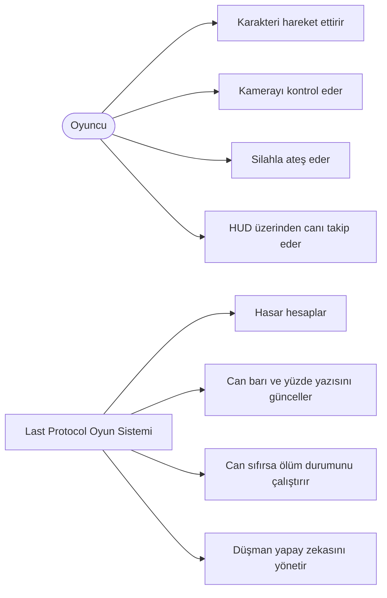
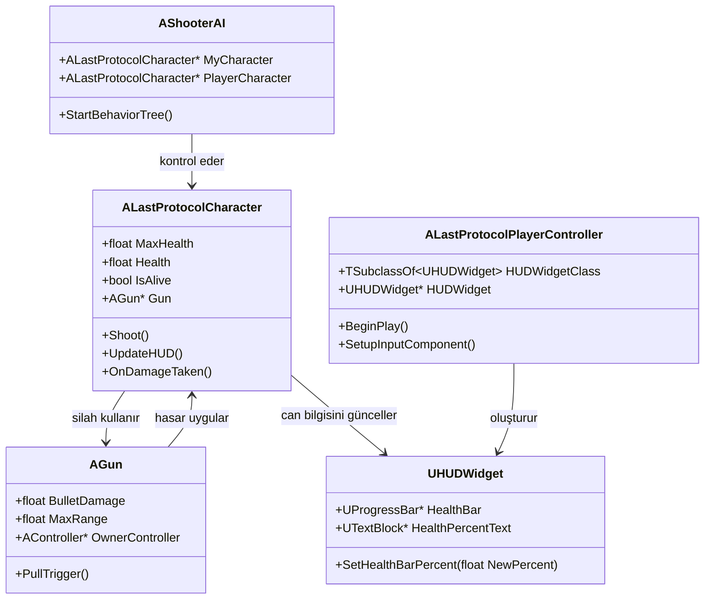
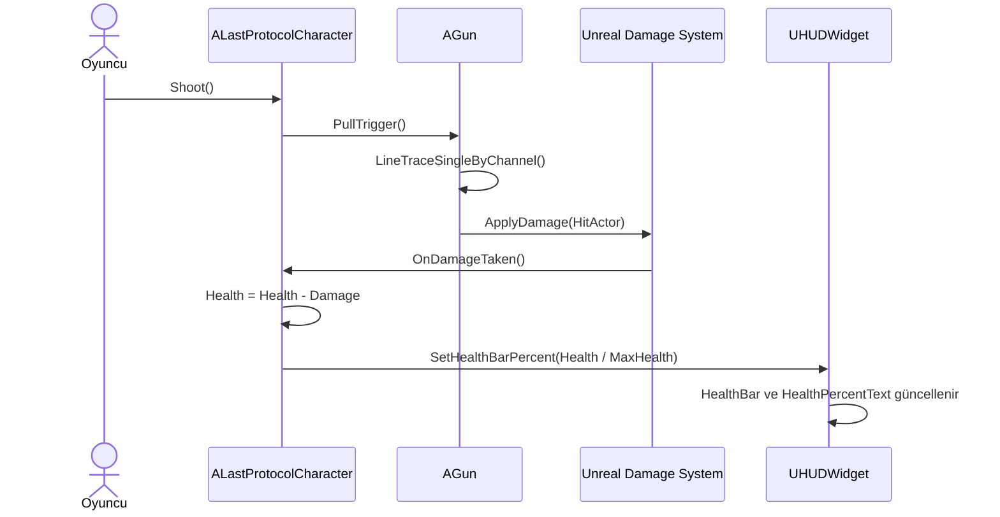
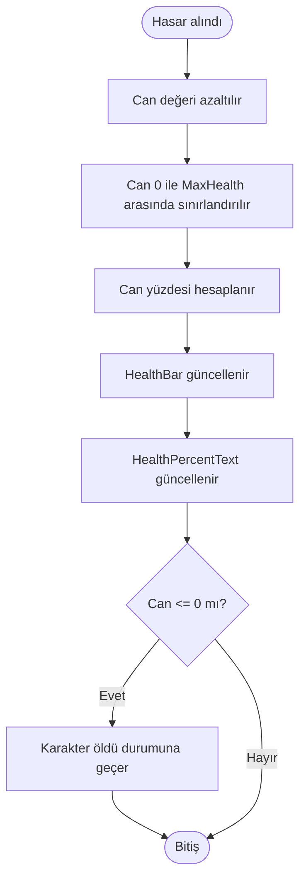

# UML Diyagramları

Bu dosyadaki diyagramlar Mermaid formatındadır. GitHub, Markdown içinde Mermaid bloklarını otomatik olarak görselleştirir.

## Kullanım Senaryosu Diyagramı

## Sınıf Diyagramı

## Ateş Etme ve Hasar Alma Sıra Diyagramı

## HUD Güncelleme Aktivite Diyagramı

